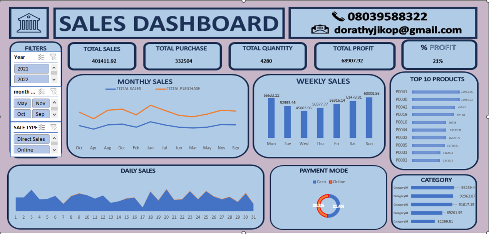

# 📊 Sales Performance Dashboard



## 📌 Project Overview

The **Sales Performance Dashboard** is an interactive data visualization project designed to analyze business sales performance. It provides insights into total sales, purchases, quantity sold, profit, product performance, payment methods, and category performance.

The dashboard helps users monitor business activities, identify sales trends, and make data-driven decisions.

## 🎯 Project Objectives

* Monitor total sales, purchases, quantity, and profit.
* Analyze monthly, weekly, and daily sales trends.
* Identify the top 10 products by sales value.
* Examine payment methods and category performance.
* Compare business performance using interactive filters.
* Support business planning and decision-making.

## 📈 Key Performance Indicators (KPIs)

| KPI               |     Value |
| ----------------- | --------: |
| Total Sales       | 40,111.92 |
| Total Purchase    | 33,204.00 |
| Total Quantity    |     4,280 |
| Total Profit      |  6,907.92 |
| Profit Percentage |       21% |

### KPI Interpretation

* **Total Sales:** The total sales value recorded is 40,111.92.
* **Total Purchase:** The total purchase value is 33,204.00.
* **Total Quantity:** A total quantity of 4,280 is displayed.
* **Total Profit:** The dashboard reports a profit of 6,907.92.
* **Profit Percentage:** The dashboard displays a profit percentage of 21%.

> **Note:** The profit percentage requires validation. Based on the displayed figures, profit divided by sales is approximately 17.2%, while profit divided by purchases is approximately 20.8%.

## 🎛️ Dashboard Filters

The dashboard contains interactive filters for:

* **Year:** 2021 and 2022
* **Month:** Allows selection of individual months.
* **Sale Type:** Direct Sales and Online.

These filters allow users to analyze specific periods and sales channels.

## 📊 Dashboard Analysis

### 1. Monthly Sales Analysis

The monthly sales line chart compares total sales and total purchases across the months.

It helps users identify monthly trends, observe fluctuations in sales, and compare sales performance with purchasing activity.

### 2. Weekly Sales Analysis

The weekly sales chart compares sales from Monday to Sunday.

From the displayed chart:

* Highest visible sales: Sunday — 6,808.56
* Lowest visible sales: Wednesday — 4,503.96

This analysis helps identify differences in sales activity across the days of the week.

### 3. Daily Sales Analysis

The daily sales area chart displays sales values across the days of the month, from day 1 to day 31.

It provides an overview of daily fluctuations and helps identify periods of relatively high or low sales activity.

### 4. Top 10 Products Analysis

The Top 10 Products chart highlights products with the highest displayed sales values.

The leading products shown include:

* P004 — approximately 2,952.16
* P030 — approximately 2,245.92

This visualization helps identify products contributing substantial sales values and supports inventory and product performance monitoring.

### 5. Payment Mode Analysis

The payment mode doughnut chart compares Cash and Online payment methods.

It provides a visual overview of the payment categories represented in the dashboard.

This information can help businesses understand payment patterns and evaluate their payment processing options.

### 6. Category Performance Analysis

The category chart compares the displayed values across different product categories.

The visible dashboard shows:

* Category04 — approximately 9,529.40
* Category03 — approximately 9,526.87

The visualization supports comparison of category-level performance.

## 🔍 Key Findings

Based on the dashboard screenshot:

1. Total sales are recorded as 40,111.92.
2. Total purchases amount to 33,204.00.
3. The reported total profit is 6,907.92.
4. Sunday has the highest displayed weekly sales value.
5. Wednesday has the lowest displayed weekly sales value.
6. P004 leads the visible Top 10 Products chart.
7. Category04 and Category03 have similar displayed values.
8. The dashboard supports analysis by year, month, and sale type.

*These findings are based on the visible dashboard and should be validated against the underlying dataset and selected filters.*

## 💡 Business Questions Addressed

The dashboard helps answer the following questions:

* What is the total sales revenue?
* What is the total purchase value?
* How much profit is recorded?
* How do sales and purchases change monthly?
* Which weekday records the highest sales?
* Which products have the highest sales values?
* How do sales fluctuate daily?
* What payment methods are represented?
* Which categories have the highest displayed values?
* How does performance differ by year and sale type?

## 🚀 Recommendations

1. **Validate KPI formulas:** Confirm the intended profit percentage calculation and ensure the label matches the formula.
2. **Verify payment mode calculations:** Confirm whether the chart represents transaction count, sales value, or another measure.
3. **Improve reporting context:** Include the reporting period, currency, data source, and refresh date.
4. **Enhance readability:** Ensure chart labels and values are clearly visible.
5. **Test dashboard filters:** Confirm that all relevant KPIs and charts respond correctly to filter selections.

## 🛠️ Tools and Technologies

The software used to create the dashboard is not identified in the screenshot.

Update this section to include the tools used in your project, such as:

* Microsoft Excel
* Power Query
* Power BI

## 📁 Repository Structure

```text
sales-performance-dashboard/
│
├── README.md
└── Picture1.png
```

## 📝 Conclusion

The Sales Performance Dashboard provides a consolidated view of business performance through key performance indicators and interactive visualizations.

It enables users to examine sales trends, compare purchasing activity, monitor profitability, identify leading products, and explore category and payment patterns.

The dashboard provides a foundation for business performance monitoring and data-driven decision-making. Validating the KPI calculations and documenting the dataset will further improve the reliability of the analysis.

---

**Project:** Sales Performance Dashboard
**Purpose:** Sales analysis and business performance monitoring
**Report Format:** GitHub README.md

